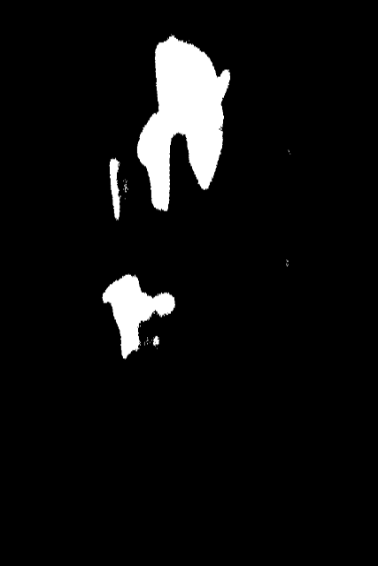

# Skin-Segmentation-TensorFlow
This is a modified [SegNet](https://arxiv.org/abs/1511.00561) convolutional neural net for segmenting human skin from images.
The model was trained on only 40 images, and while it manages an F1 score 0.90, it is in no way extremely generalizable, it was done as a simple project, to test if a CNN could be trained from scratch on a small dataset.

# Main Idea:
The code emphasizes readability, simplicity and ease of understanding. It is meant to be looked at if you are starting out with TensorFlow and looking into building your own model. There are only two files, one for data loading, and one for the model definition, training and testing.

# Examples:
 

Free stock image taken from [Pixabay](https://pixabay.com/)

# Explanation of Code Snippets:
Convolution is done with the tf.layers.conv2d layer, like so:
```python
def conv_with_bn(x, no_of_filters, kernel_size, training, strides=[1, 1], activation=tf.nn.relu, use_bias=True, name=None):
    conv = tf.layers.conv2d(x, no_of_filters, kernel_size, strides, padding='SAME', activation=activation,
                            use_bias=use_bias, kernel_initializer=tf.contrib.layers.xavier_initializer(), name=name)
    conv = tf.layers.batch_normalization(conv, training=training)

    return conv
```
Downsampling is done again with the same convolutional layer, only with the strides changed to 2.

Upsampling is done via transpose convolutions:
```python
def trans_conv_with_bn(x, no_of_filters, kernel_size, training, strides=[2, 2], activation=tf.nn.relu, use_bias=True, name=None):
    conv = tf.layers.conv2d_transpose(x, no_of_filters, kernel_size, strides, padding='SAME', activation=activation,
                                      use_bias=use_bias, kernel_initializer=tf.contrib.layers.xavier_initializer(), name=name)
    conv = tf.layers.batch_normalization(conv, training=training)
    return conv
```

The model itself is defined in the inference function:
```python
def inference(image_tensor, is_training):
    """Runs image through the network and returns predicted mask."""

    print('Building Network for Inference...')

    conv0 = conv_with_bn(image_tensor, 64, [3, 3], is_training, name='conv0')
    down0 = conv_with_bn(conv0, 64, [3, 3], is_training, [2, 2], name='down0')

    conv1 = conv_with_bn(down0, 128, [3, 3], is_training, name='conv1')
    down1 = conv_with_bn(conv1, 128, [3, 3], is_training, [2, 2], name='down1')

    conv2 = conv_with_bn(down1, 256, [3, 3], is_training, name='conv2')
    down2 = conv_with_bn(conv2, 256, [3, 3], is_training, [2, 2], name='down2')

    conv3 = conv_with_bn(down2, 512, [3, 3], is_training, name='conv3')
    down3 = conv_with_bn(conv3, 512, [3, 3], is_training, [2, 2], name='down3')

    up3 = trans_conv_with_bn(down3, 512, [3, 3], is_training, name='up3')
    unconv3 = conv_with_bn(up3, 512, [3, 3], is_training, name='unconv3')

    up2 = trans_conv_with_bn(unconv3, 256, [3, 3], is_training, name='up2')
    unconv2 = conv_with_bn(up2, 256, [3, 3], is_training, name='unconv2')

    up1 = trans_conv_with_bn(unconv2, 128, [3, 3], is_training, name='up1')
    unconv1 = conv_with_bn(up1, 128, [3, 3], is_training, name='unconv1')

    up0 = trans_conv_with_bn(unconv1, 64, [3, 3], is_training, name='up0')
    unconv0 = conv_with_bn(up0, 64, [3, 3], is_training, name='unconv0')

    pred = conv_with_bn(unconv0, NUM_CLASSES, [
                        3, 3], is_training, activation=None, use_bias=False, name='pred')

    print('Done, network built.')
    return pred
```
As can be seen, the model has 9 convolutional layers and calculates upto 512 feature maps. The architecture is simple to understand, the focus here is on readability.

# TODOs:
1. Add model graph for visualization.
2. Comment code for further readability.
3. Extend and explain the input pipeline.
